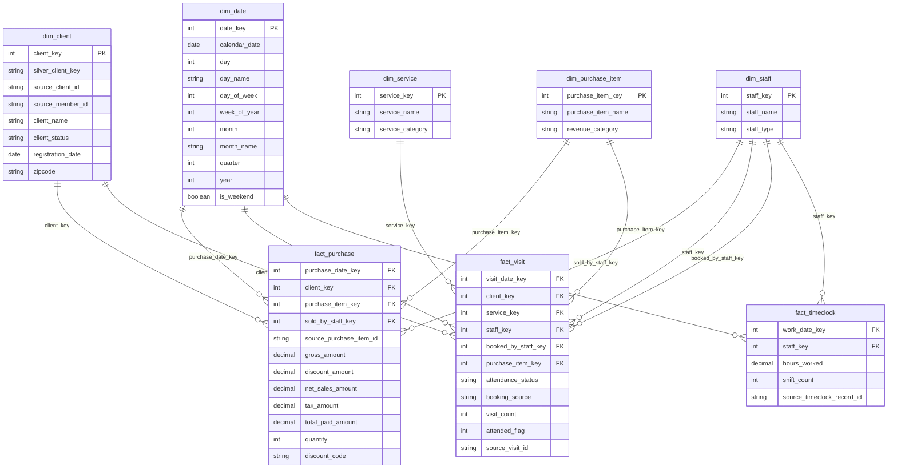

# Gold Model ERD

This Gold layer is a star schema built from the current Silver entities in `saltroom_lakehouse`.

Special key usage:
- `0 = Unknown` for all dimensions except `dim_date`
- `-1 = Online` only in `dim_staff`

Architectural notes:
- `fact_purchase` keeps `discount_code` as a degenerate dimension in the fact table.
- There is no `dim_location`.
- There is no visit-purchase bridge at this stage because visit purchase option maps directly to `dim_purchase_item`.

Fact grain:
- `fact_purchase`: one row per Silver purchase line item
- `fact_visit`: one row per Silver visit / attendance record
- `fact_timeclock`: one row per Silver timeclock row

